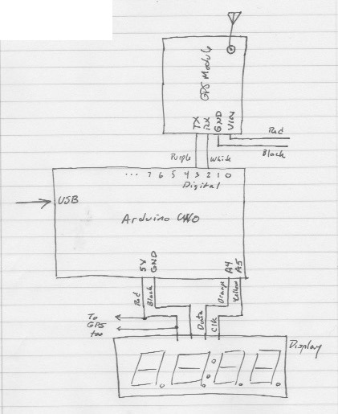

# GPSClock
Use GPS satellites to display the current UTC time with Adafruit GPS and LED breakouts and an Arduino. Great for remote cloud engineers.

## Software

### Libraries
- https://github.com/adafruit/Adafruit-GPS-Library
- https://github.com/adafruit/Adafruit-LED-Backpack-Library
- https://github.com/adafruit/Adafruit-GFX-Library

## Hardware
 - Arduino UNO
 - [Adafruit Ultimate GPS Breakout](https://www.adafruit.com/product/746)
 - [Adafruit 0.56" 4-Digit 7-Segment Display with I2C](https://www.adafruit.com/product/881)

## Wiring

Note: Although it may seem odd to use analog pins for I2C, A4 and A5 are dedicated to I2C on Arduino UNOs as Serial Data (SDA) and Serial Clock (SCL) respectively. See https://docs.arduino.cc/learn/communication/wire#arduino-i2c-pins

